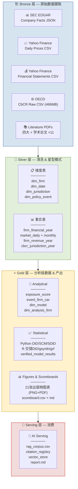
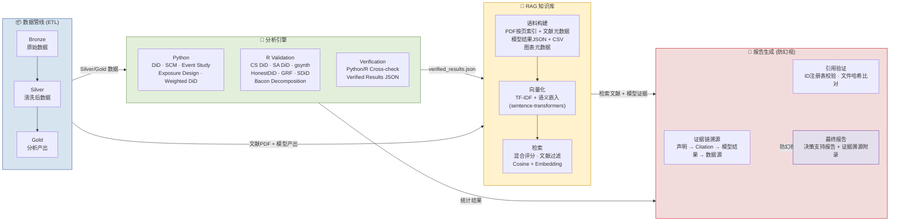

# 项目架构图

## 1. ETL 数据管线架构 (Medallion Architecture)

## 2. ETL + AI 集成架构

## 图例说明

| 颜色 | 含义 | 对应架构层 |
|:---|:---|:---|
| 🔵 蓝色 | 数据存储 / ETL | Bronze · Silver · Gold |
| 🟢 绿色 | 分析计算 | Python · R · Verification |
| 🟡 黄色 | 知识检索 | RAG · Embedding · Retrieval |
| 🔴 红色 | 报告生成 | Evidence Chain · Citation · Report |
| 🟣 紫色 | 最终交付 | Decision Support Report |

## SVG 文件

高分辨率 SVG 版本已生成在：
- `data/gold/figures/Figure_arch_etl_pipeline.svg`
- `data/gold/figures/Figure_arch_etl_ai_integration.svg`
